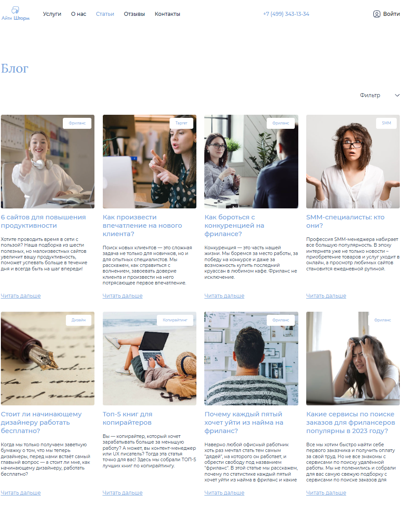

# Wstudio
This project was generated with [Angular CLI](https://github.com/angular/angular-cli) version 16.2.16.

Учебный проект сайта Веб студии.

скрины страниц

  

     
    <small>Главная страница</small>
  

  

     
    <small>Настройки</small>
  

